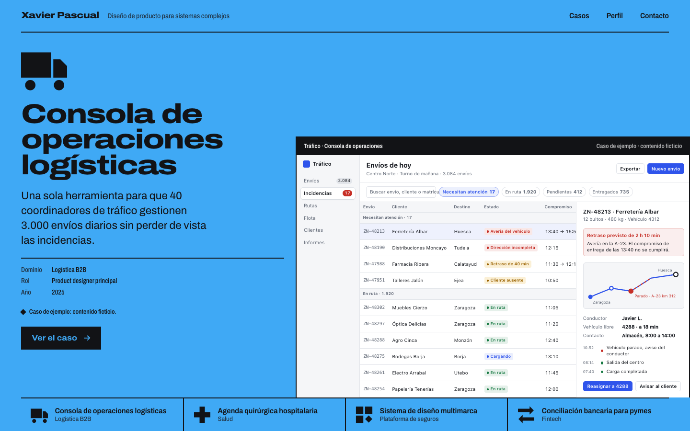
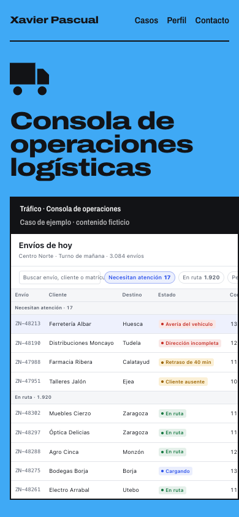
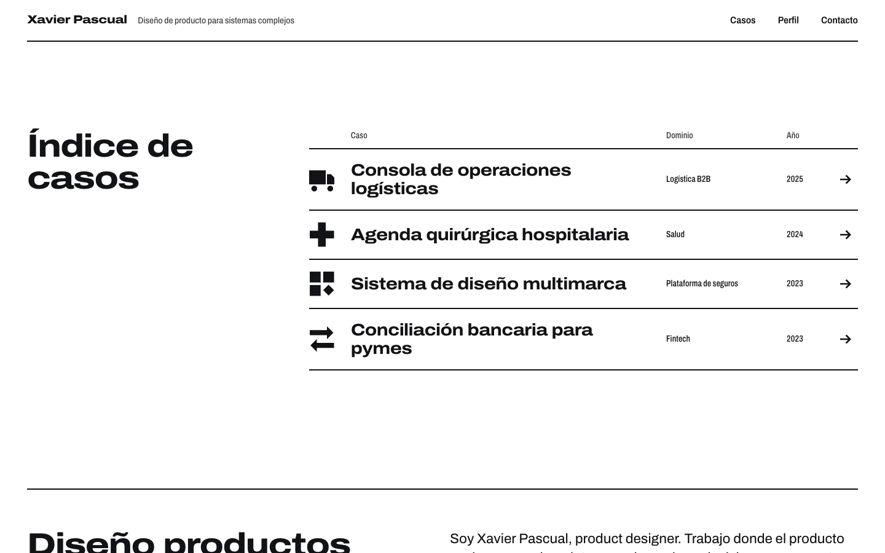
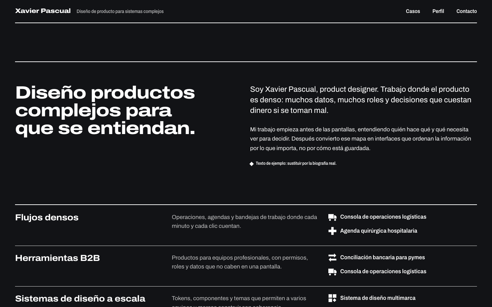
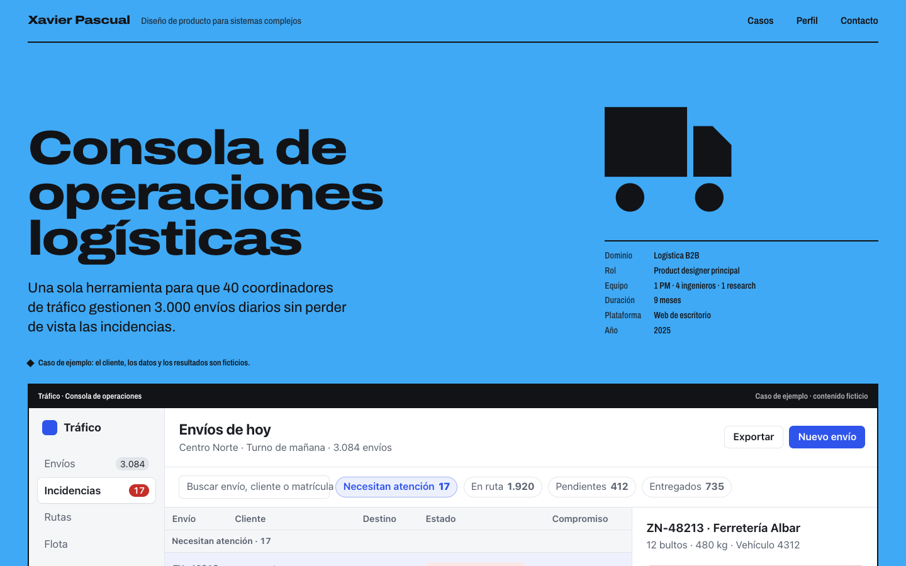
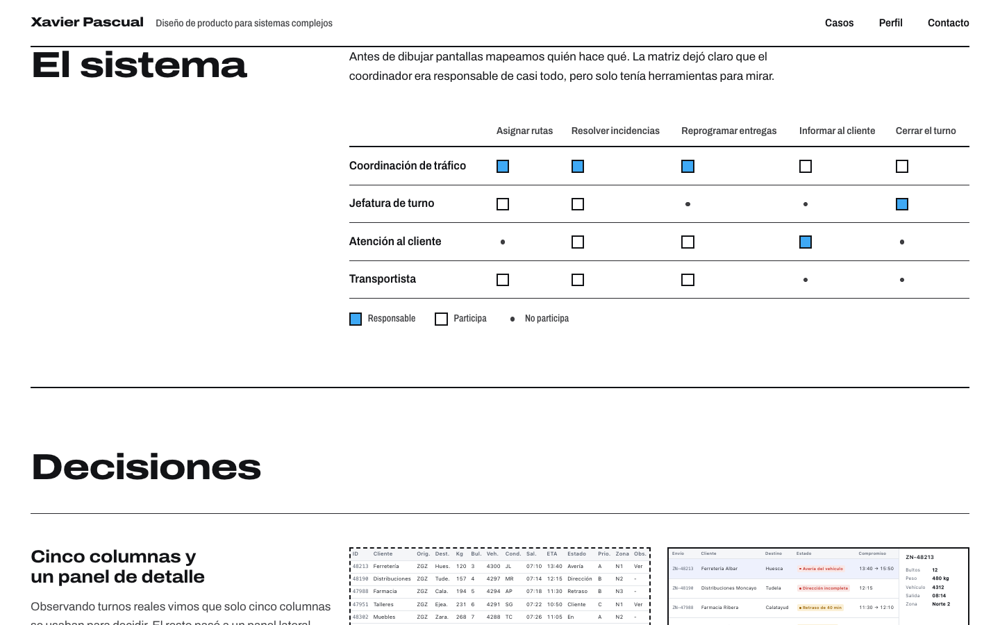

# Xavier Pascual · Diseño de producto para sistemas complejos

Portfolio de diseño de producto hecho con Next.js y diseñado con **impeccable**, una skill de diseño para agentes de código (aquí, Claude Code). Presenta casos de estudio de productos densos: operaciones logísticas, agendas clínicas, sistemas de diseño y fintech.

<p>
  
  
</p>

> [!IMPORTANT]
> **Contenido de ejemplo.** Los cuatro casos de estudio, la biografía y los datos de contacto (`hola@ejemplo.com`) son ficticios y están marcados como tales en la propia web. La estructura, el diseño y el código son definitivos; el contenido está pendiente de sustituir por los casos reales.

---

## Qué es

Un portfolio personal, solo en español, para un product designer especializado en **sistemas complejos**: flujos densos, herramientas B2B y sistemas de diseño a escala.

Tiene dos públicos, con el mismo peso:

- **Hiring managers y recruiters** que deciden si entrevistar al diseñador para un puesto de producto.
- **Clientes** con un problema de producto que buscan a alguien para un proyecto.

Los casos son el producto. Cada uno cuenta el problema, el sistema de roles y tareas, las decisiones de diseño con su antes y después, y el resultado.

| Caso | Dominio | Color de campo | Pantalla de ejemplo |
|---|---|---|---|
| Consola de operaciones logísticas | Logística B2B | Azul `#3FA9F5` | Tráfico · Consola de operaciones |
| Agenda quirúrgica hospitalaria | Salud | Verde `#2BC48A` | Bloque Q · Agenda quirúrgica |
| Sistema de diseño multimarca | Plataforma de seguros | Naranja `#FF7A1A` | Atlas · Sistema de diseño |
| Conciliación bancaria para pymes | Fintech | Amarillo `#FFD230` | Cuadra · Conciliación bancaria |

---

## Cómo se ha trabajado con impeccable

El diseño no salió de una plantilla. Siguió el proceso de impeccable, y cada paso dejó un archivo en el repositorio:

1. **Contexto de producto → [`PRODUCT.md`](PRODUCT.md).** Público, propósito, posicionamiento, principios ("el trabajo manda", "enseñar el razonamiento, no solo las pantallas", "solo afirmaciones verdaderas") y las decisiones que siguen abiertas.
2. **Brief de superficie → [`.impeccable/briefs/portfolio.md`](.impeccable/briefs/portfolio.md).** La home y la plantilla de caso, en modo *Experience*: el trabajo se ve desde la primera pantalla. De tres direcciones visuales se eligió **Programa de identidad**, en la línea del Múnich '72 de Otl Aicher y la Barcelona '92 de Trias: el orden es la prueba de que la complejidad está resuelta. Descarta a propósito el portfolio por defecto (hero simpático y rejilla de tarjetas redondeadas sobre fondo pastel).
3. **Construcción desde el código.** No se generaron imágenes. El trabajo se muestra con *obras*: pantallas de producto programadas como componentes React ([`app/_components/obras/`](app/_components/obras/)). Tienen tipografía y tokens propios para que se lean como el producto de otra empresa dentro del programa.
4. **Revisión visual → [`.impeccable/review/`](.impeccable/review/).** Capturas de la home y de un caso a 1440 × 900, 1280 × 800 y 390 × 844. Los ajustes que salieron de esa revisión están anotados en el brief; por ejemplo, el texto de cada placa de la home pasó de 4 a 5 columnas porque los títulos desbordaban a 1440 px.
5. **Sistema documentado → [`DESIGN.md`](DESIGN.md) y [`.impeccable/design.json`](.impeccable/design.json).** Colores, tipografía, layout, componentes, reglas con nombre ("El campo es el color", "Una sola familia", "Programa plano") y una lista de qué hacer y qué no.
6. **Detector de diseño → [`.codex/hooks.json`](.codex/hooks.json) y [`.cursor/hooks.json`](.cursor/hooks.json).** Hooks de impeccable que revisan la interfaz tras cada edición cuando se trabaja con Codex o Cursor. Solo actúan si la skill está instalada en el proyecto.

> [!NOTE]
> El lanzador de impeccable estaba bloqueado por los permisos del entorno. Por eso el brief se escribió a mano y la dirección se eligió entre propuestas razonadas, sin el sorteo de `concept-seed`. El propio brief lo deja anotado.

---

## El sistema visual

- **Un campo y un pictograma por caso.** El color saturado solo aparece como fondo completo, nunca como detalle. Los pictogramas son sólidos, sobre una retícula de 48 unidades, con ángulos de 0°, 45° y 90° y círculos completos ([`Pictograma.tsx`](app/_components/Pictograma.tsx)).
- **La página cambia de color.** Es la interacción que identifica la web. Al hacer scroll, el fondo de toda la página pasa en 720 ms al color de la zona que cruza la línea de lectura. Al pasar el cursor por la leyenda o el índice se previsualiza el color de ese caso. El primer pintado ya llega con el color correcto desde el servidor. Sin JavaScript, cada zona pinta su propio fondo, y con `prefers-reduced-motion` el cambio es instantáneo ([`Campo.tsx`](app/_components/Campo.tsx)).
- **Una sola familia tipográfica: Archivo,** usada por ancho × peso, como Univers: extendida y muy pesada en los titulares, normal para leer, y condensada con cifras tabulares para los datos.
- **Rejilla estricta de 12 columnas.** El título va en las columnas 1–4 y el contenido en las 5–12.
- **Plano y cuadrado.** Sin esquinas redondeadas, sombras ni degradados. La estructura se dibuja con reglas de tinta de 2 px.

Además de los cuatro campos de caso: tinta `#121316`, papel `#FFFFFF` y plata `#D9DCDF`. El detalle completo está en [`DESIGN.md`](DESIGN.md).

---

## Páginas

**`/` · Home**

- Una placa a pantalla completa por caso, con pictograma, título, resumen, ficha y la obra desbordando hacia el borde.
- Leyenda de casos, índice, perfil sobre fondo tinta y contacto.

**`/casos/[slug]` · Plantilla de caso**

Sigue este orden:

1. Cabecera con el pictograma a escala póster y la ficha (dominio, rol, equipo, duración, plataforma y año).
2. **El problema**, con un inventario de la complejidad de partida.
3. **El sistema**, con la matriz de roles por tareas.
4. **Decisiones**, con fragmentos de antes y después.
5. **Resultado**, con las métricas.
6. **Lo que aprendí**.
7. **Siguiente caso**, que ya trae su color.

Las cuatro páginas de caso se generan en estático (`generateStaticParams` con `dynamicParams = false`).

| Índice de casos | Perfil |
|---|---|
|  |  |
| **Cabecera de caso** | **Matriz de roles y decisiones** |
|  |  |

---

## Stack

| | |
|---|---|
| **Next.js 16.3.4** | App Router y páginas de caso generadas en estático |
| **React 19.2.8** | Componentes de servidor; solo `Campo.tsx` se ejecuta en el cliente |
| **TypeScript 5** | Todo el proyecto |
| **`next/font`** | Archivo, de Google Fonts, con el eje de ancho (`wdth`) |
| **CSS propio** | Custom properties, `@property`, `color-mix()` en OKLab y container queries (`cqi`) |
| **Tailwind CSS 4** | Instalado vía PostCSS e importado en `globals.css`; el diseño no usa clases de utilidad |
| **ESLint 9** | Con `eslint-config-next` |

No hay más dependencias en tiempo de ejecución que Next y React, y la web no usa imágenes: todo lo visual es SVG, CSS y componentes.

---

## Puesta en marcha

**Requisitos:** Node.js 20.9 o superior y npm.

```bash
git clone https://github.com/mokkapp-studio/Workshop-impeccable-portfolio.git
cd Workshop-impeccable-portfolio
npm install
npm run dev
```

Abre <http://localhost:3000>.

| Comando | Qué hace |
|---|---|
| `npm run dev` | Servidor de desarrollo con recarga en caliente |
| `npm run build` | Build de producción |
| `npm start` | Sirve el build de producción (ejecuta `build` antes) |
| `npm run lint` | Revisa el código con ESLint |

---

## Estructura

```text
app/
├── layout.tsx               # HTML raíz, fuente Archivo, metadatos, cabecera y <Campo />
├── page.tsx                 # Home: placas de caso, índice, perfil y contacto
├── casos/[slug]/page.tsx    # Plantilla de caso, generada en estático
├── _data/casos.ts           # Contenido de los casos y tipo Caso
├── _components/
│   ├── Cabecera.tsx         # Barra superior: nombre y navegación
│   ├── Campo.tsx            # Cambio de color de la página (cliente)
│   ├── Pantalla.tsx         # Marco de las obras y de los fragmentos antes/después
│   ├── Pictograma.tsx       # Pictogramas de caso y flecha
│   └── obras/               # Pantallas de producto de cada caso
│       ├── Logistica.tsx
│       ├── Clinica.tsx
│       ├── Sistema.tsx
│       ├── Tesoreria.tsx
│       └── index.ts         # Registro de obras y fragmentos por slug
├── globals.css              # Tokens, tipografía, rejilla y home
├── caso.css                 # Plantilla de caso
└── obra.css                 # Estilos internos de las obras

PRODUCT.md                   # Contexto de producto (impeccable)
DESIGN.md                    # Sistema de diseño (impeccable)
.impeccable/
├── briefs/portfolio.md      # Brief de superficie y dirección elegida
├── design.json              # Sistema de diseño en formato máquina
├── review/                  # Capturas de la revisión visual
└── live/config.json         # Configuración del modo live
AGENTS.md · CLAUDE.md        # Instrucciones para agentes de código
```

---

## Sustituir el contenido de ejemplo

1. **Casos.** Edita el array `casos` en [`app/_data/casos.ts`](app/_data/casos.ts). El tipo `Caso` define cada campo: ficha, problema, matriz, decisiones, resultado y aprendizaje.
2. **Pantallas.** Cada caso tiene una obra en [`app/_components/obras/`](app/_components/obras/) que exporta un componente `Hero…` y un objeto `fragmentos…` con el antes y el después de cada decisión. Regístrala en `obras/index.ts` con el `slug` del caso como clave. Si tienes capturas reales, `Pantalla` y `Fragmento` pueden envolver una imagen en lugar de UI programada.
3. **Pictograma.** Añade el id a `PictogramaId` y dibuja su forma en [`Pictograma.tsx`](app/_components/Pictograma.tsx).
4. **Color.** Declara la variable `--f-…` en [`app/globals.css`](app/globals.css) y úsala en el campo `campo` del caso.
5. **Perfil y contacto.** La biografía, el email y LinkedIn están en [`app/page.tsx`](app/page.tsx); el título y la descripción del sitio, en [`app/layout.tsx`](app/layout.tsx).
6. **Avisos.** Cuando el contenido sea real, quita los párrafos `aviso-ficticio`.

Cada caso nuevo necesita exactamente un campo de color y un pictograma. Las reglas completas están en la sección *Do's and Don'ts* de [`DESIGN.md`](DESIGN.md).

---

## Antes de tocar el código

Este proyecto usa **Next.js 16**, que trae cambios de API y convenciones respecto a versiones anteriores. Consulta la guía que viene con el paquete, en `node_modules/next/dist/docs/`, antes de escribir código (lo recuerda [`AGENTS.md`](AGENTS.md)).
